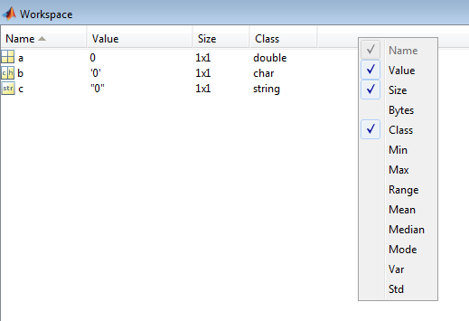

DyMoMa - A dynamic modelling platform for MATLAB
=========================================

An object-oriented framework in MATLAB for defining and running linear and non-linear dynamic models.

Also available on 

## Cite as
David Katzin. DyMoMa - Dynamic Modelling for MATLAB. Zenodo. http://doi.org/10.5281/zenodo.3697908

## Current release
DyMoMa v1.0.1 - fixed some small bugs, added an events attribute (currently in development). The idea is to be able to send events to the ODE solver, see [ODE Event Location](https://nl.mathworks.com/help/matlab/math/ode-event-location.html).

## Maintainers
* David Katzin, `david.katzin@wur.nl`, `david.katzin1@gmail.com`

## Compatability
The code in this repository has been tested for compatibility with MATLAB 2015b and onwards. Certain functionalities require the [Tomlab](https://tomopt.com/tomlab/)  package.

## In this repository

- `readme.md, Workspace.png`  - Readme file and supporting images
- `license.md` - The license for this repository (Apache 2.0)
- *Code*
   - `example.m` - Basic example for using this framework, see Sections [3.2](#32-scheme-for-setting-up-a-dynamicmodel), [4](#4-using-the-dynamicmodel-objects) below
   - *@DynamicElement* - Files for the DynamicElement class
      - `DynamicElement.m` - Definition of the DynamicElement class, see [Section 2](#2-the-dynamicelement-class) below
   - *@DynamicModel* - Files for the DynamicModel class, see Section 3 below
      - `DynamicModel.m` - Defines the DynamicModel class
	  - **Functions for setting or adding fields** (see [Section 3.2](#32-scheme-for-setting-up-a-dynamicmodel) below)
		- `setTime.m` - Set the time field `t`
		- `addParam.m` - Add a new parameter
		- `setParam.m` - Change the value of an existing parameter
		- `addInput.m` - Add a new input
		- `addState.m` - Add a new state
		- `addControl.m` - Add a new control
		- `addAux.m` - Add a new auxiliary state
		- `setOde.m` - Set the ODE for a state
	  - **Functions for simulating the model** (see [Section 4.3](#43-simulating) below)
		- `solveEuler.m` - Solve using the Euler method
		- `solveOde.m` - Solve using MATLAB's built-in ODE solvers
		- `solveFromFile.m` - Solve by generating a temporary file
		- `solveTomlab.m` - Solve by using the Tomlab package
	  - **Function for analyzing the model**
		- `plot.m` - Plot the model
		- `show.m` - Display information about the model in the console
		- `compareParams.m` - Compare the parameter values of two models 
		- `corrcoef.m` - Calculate the Pearson correlation coefficient between all elements in the model and a given input.
		- `xtickNumToDate.m` - Display dates on the x axis of a plotted DynamicElement from the model
	  - **Functions for modifying a model**
		- `changeRes.m` - Change the resolution (time step) in the model's trajectories.
		- `concat.m` - Concatenate together the results of two simulations.
		- `cutTime.m` - Cut out a part of the timeline of a simulated model.
	  - **Functions used by other functions**
		- `getFieldNames.m` - Returns the names of all the variables of a model
		- `makeFuncFile.m` - Used by `solveFromFile`
		- `defExpand.m` - Used by `solveOde`, `makeFuncFile`
		- `setSolution.m` - Used by `makeFuncFile`
		- `getInitialStates.m` - Used by `solveOde`, `makeFuncFile`  
   - *Other functions* - Functions that are not part of the class definitions
      - *CmdLineProgressBar* - Visualize running time during simulation. By Ita Katz (with some modifications).
      - `ifElse.m` - Create a DynamicElement based on a logical expression.
      - `proportionalControl.m` - Create a DynamicElement which responds proportionally to disturbances.
	  - `getOdes.m` - Used by `solveOde`.

## 1. Background

### 1.1 Introduction

This platform allows to design and simulate models that are defined as [state space models](https://en.wikipedia.org/wiki/State-space_representation), i.e., models defined by ordinary differential equations (ODEs), both linear and non-linear. Three principals lie at the core of this platform:
1. **Clarity:** The models designed in this framework can be easily read, in particular, the underlying functions, i.e., the ODEs defining the model, are explicit.
2. **Modularity:** In this framework it is easy to replace one model for another, modify a single function within a model, or modify the way models are solved, without rewriting big pieces of code.
3. **Separability:** There is a clear distinction between a description of a model (its ODEs, parameters, interpretation) and the model solvers.

The above principles make this platform stand out from other modeling platforms in the sense that models defined in this platform are easy to create, understand, and modify. An object representing a model contains within it all the definitions, equations, parameters and values for the model. These can (and should!) be accompanied by documentation giving references (e.g., literature) to each decision made during model design. After simulating, all the simulated data and outputs are automatically stored in a structured manner. All of the above is kept separate from the methods or scripts dedicated to solving/simulating the model, which are kept at an abstract level that can be applied to any model. In other words, you can focus only on your model without worrying about how to represent the model in code, how to save important information about each simulation, or about the technicalities of solving and simulating. Alternatively, anyone can develop new methods for solving or analyzing models which are immediately applicable to all models developed within this framework.

Several definitions are needed in the upcoming sections:

- **Model definition** is the set of ordinary differential equations describing the model. The number of equations is equal to the number of states in the model.
- **Model solving** refers to solving the boundary-value problem, i.e., the model ODEs together with initial values for all states. In other words, this is **simulating** the model. In the case of optimal control (OC) problems, this also includes solving the OC problem, i.e., finding an optimal solution.
- **Smoothness and stiffness** are properties of the model definitions. These are relative terms. Mathematically, a function that is more smooth has more continuous derivatives. Stiffness is the opposite of smoothness, i.e., a stiff function has few (or no) continuous derivatives. Some stiff functions that regularly occur in modeling are absolute value (near zero), square root (near zero), and if/else statements.

### 1.2 State space representation of models

In this section, we present a general description of [state space models](https://en.wikipedia.org/wiki/State-space_representation). These models are composed of the following:

- **Time *(t)*** - The variable that is being derived in the ODEs. Typically the model starts at *t=0* and ends at some predefined end point *t=t_f*. However there are state space models with variable end points, i.e., *t_f* depends on the states.
- **Parameters *(p)*** (*constants*) are any variables that do not change throughout the model run. It is generally better to avoid using numbers in your model definition. Give any consant number a variable name and assign it as a parameter.
- **States *(x)*** (also known as *state variables*) are the variables in the model that are defined by ODEs that depend on the time variable *t*. Thus an ODE for the state *x* would look something like:  
*dx/dt = f(x,t)*  
For every state in the model there is one ODE, and vice versa.
- **Auxilliary states *(a)*** (also known as *semi-states*) are variables that depend on the time variable *t* and also possible on other model variables (states, inputs, parameters, other auxiliary states), but do not have their own ODE. These are typically variables that need to be tracked for some reason, or that make the ODEs more easy to read. For instance, we might have a state *x* and auxilliary states *a_1* and *a_2*, where  
*dx/dt = a_1(t)+a_2(t)*  
*a_1(t) = sin(t)*  
*a_2(t) = cos(t)*  
- **Inputs *(d)*** (also known as *disturbances* or *uncontrolled inputs*) are variables that depend on the time variable *t* only. They are external to the model, can influence it, but and are not influenced by it.
- **Controls *(u)*** (also termed *controlled inputs*) represent variables that can be controlled by the system. For example in a greenhouse model, the weather may be considered as an uncontrolled input *(d)*, but the greenhouse actuators (e.g., window opening) is a controlled input *(u)*.
- **Constraints *(c)*** (or *bounds*) A set of equalities and inequalities which the states and controls must maintain. Important for optimization problems.
- **Goal function *(g)*** (or *objective function*) in the case of optimization problems, this function defines the optimality criterion.

*Note 1:* A state space model can be constructed with simply a time variable and a single state variable. All other components of the model listed above are optional. 

*Note 2:* Typically, state space models are composed of linear equations and can be represented by matrices. However, with the above definition that doesn't have to be the case. Non-linear equations also work just fine. 

### 1.3 Object oriented programming

[Object-oriented programming (OOP)](https://en.wikipedia.org/wiki/Object-oriented_programming) is "a programming paradigm based on the concept of "objects", which may contain data, in the form of fields, often known as attributes; and code, in the form of procedures, often known as methods" ([Wikipedia](https://en.wikipedia.org/wiki/Object-oriented_programming)). It is a cornerstone of modern programming, and is especially useful for the principal of separability described above. In the state space modelling framework, a model (its definition) is defined as an object, and a solver is a method which acts on this object.

#### Variable classes
In MATLAB, every declared variable belongs to a *class*. This is not always explicit, but the class determines how the variable is stored in memory and how functions act on it. As a simple example, try the following in MATLAB:

> `a = 0;` 
> `b = '0';`  
> `c = "0";`  

In your workspace, you can see the classes of current variables:

 

You can see that `a` belongs to the class "double" (a format for storing real numbers), `b` bleongs to the class "char" (a format for storing characters), and `c` bleongs to the class "string" (a format for storing text strings). This might not mean a lot, but try the following:

> `>> a+5`

> `ans =`

> `5`

> `>> b+5`

> `ans =`

> `53`

> `>> c+5`

> `ans =`

> `"05"`

It's not important to figure out why these seemingly strange answers come out, what matters here is that the function "+5" behaves differently for each of these different variable classes. 

In object oriented programming, it is possible to define new variable classes, and methods that act on these classes. A variable that is made using a custom class is typically called an *instance* or an *object* of that class. Objects of custom classes typically have *attributes*, also called *properties*. These properties are quite similar to MATLAB `struct`s, with the exception that the object follows a fixed format. 

A new class is created in MATLAB by creating a file with the class name, e.g., `ClassName.m` (class names typically begin with an uppercase letter), and starting that file with the expression 
`classdef ClassName` 

After this expression the symbol `< ` may follow, and some more text which has to do with *class inheritance*, which is not covered in this tutorial. All files related to a particular class may be grouped in a folder named `@ClassName`.

A new instance of a custom class is created using the class *constructor*, which is a function that has the same name as the class. For example, an instance `a` of the class `NewClass` will be created as:

>> `a = NewClass();`

### 1.4 Handle and value classes

There is a distinction in MATLAB between *handle* and *value* classes. Handle classes basically hold an address in memory (this is called a *pointer* in other programming languages), and so passing a handle variable to a function actually passes its location in memory, and any changes to that variable inside a function will influence the variable. This, Handle classes have a sort of global feature, where functions that change the variable do not need to return the argument. Consider two variables, `v` and `h`, each of the respective type of class, and consider the function:

> `function setToZero(arg)`

> > `arg = 0;`

> `end`

Running `setToZero(v)` will not change `v` since `arg` inside the function is a new copy of `v`. However running `setToZero(h)` will change `h`, because `arg` and `h` both point to the same location in memory.

Similarly, setting `h1 = h;` will not create a new variable; any changes made to `h1` will also affect `h`. Assume `h` has a property `val`. The following will happen:

> `h.val = 100;`  
> `h1 = h;`  
> `h1.val = 0;`  
> `h`
> > `HandleClass with properties:`
> > > `val: 0`

This is just an example. It will not work if you try to run it in MATLAB, because the class HandleClass has not been defined. The classes described below, `DynamicElement` and `DynamicModel` are handle classes. You can experiment with cases such as above once you create objects of these classes.

Another interesting feature in handle classes is the distinction between the operators `==` and `isequal`. The operator `==` will return `true` only if the objects on each side point to the same place in memory, i.e., changes made to the one will influence the other. The operator `isequal` will return true if both objects have the same values. Thus:

> `h1 = HandleClass();` 
> `h2 = HandleClass();` 
> `h3 = h1;`  
> `h1 == h2`
> > `ans = ` 
> > `logical` 
> > `0` 

> `isequal(h1,h2)` 
> > `ans = ` 
> > `logical` 
> > `1` 

> `h1 == h3` 
> > `ans = ` 
> > `logical` 
> > `1` 

> `isequal(h1,h3)` 
> > `ans = ` 
> > `logical` 
> > `1`

### 1.5 Note for working with new classes in MATLAB

A common problem that occurs when working with new classes in MATLAB is that a new function is created but MATLAB doesn't recognize it. A common error message that comes up is:

`Undefined function 'myFunction' for input arguments of type 'myClass'.`

In order to solve this, run the command

`clear classes`.

This should solve the issue, but unfortunately also clears the workspace from all working variables.

## 2. The DynamicElement class

A DynamicElement represents an entity that changes through time. An object of this class has three properties: 

- `label` - The name of the object. This is typically a string containing the name of the variable. For example the state `x.state1` will typically have the label `'x.state1'`
- `def` - The mathematical definition of the object represented by a function handle of the form `@(x,a,u,d,p)<some function>`. For example in the case of states, their `def` will contain the relevant ODE.
- `val` - The value(s) of the object's trajectory. These could be either a single number, e.g., in the case of parameters or initial values, or a 2-column matrix, where the first column represents time, and the second column represents values. 

The DynamicElement class is a handle class.

### 2.1 Creating a new DynamicElement 
A new DynamicElement is created by using a constructor:  
> `  de = DynamicElement(); ` 
> `  de = DynamicElement(deOld); ` 
> `  de = DynamicElement(label); ` 
> `  de = DynamicElement(label, def); ` 
> `  de = DynamicElement(label, val); ` 
> `  de = DynamicElement(label, def, val); ` 
> `  de = DynamicElement(label, val, def); ` 

If no arguments are passed, an empty DynamicElement is created:

> `>> de = DynamicElement()`  
> `de = ` 
> > ` DynamicElement with properties:`

> > > `label: [] ` 
	`def: [] ` 
    `val: [] `

If a single argument is given which is already an existing DynamicElement (`DynamicElement(deOld)`), a copy of the given DynamicElement `deOld` will be made.

If a single argument is given which is a char or string, it will be set as the object's `label` and `def`.

> `>> de = DynamicElement('label')`  
> `de = ` 
> > ` DynamicElement with properties:`

> > > ` label: 'label' ` 
> 	`def: @(x,a,u,d,p)label ` 
>    `val: [] `

If more than one argument is given, the constructor will assign the new DynamicElement with the corresponding values. The first argument must always be the DynamicElement's label, and if no `def` is given, the `def` will be created based on the `label`.

### 2.2 DynamicElement set methods

The methods `setDef(de, def)`, `setLabel(de, label)`, and `setVal(de, val)` will set the corresponding field of the DynamicElement `de` with the given argument. It is advisable to use these methods rather than directly manipulating an object's field, since these methods also check that the given argument fits the structure of the DynamicElement class. Thus,
> `  setVal(de, 6); ` 
> `  de.val = 6; ` 

will have the same effect, but
> `  setVal(de, 'six'); ` 

will throw an error, while `de.val = 'six'` will not.

Using `setVal` also protects against unintentional typos. For instance if the variable `df` doesn't exist, 
> `  setVal(df, 6); ` 

will throw an error, while `df.val = 6` will create a new struct variable `df.val` and will asign it the value 6.

### 2.3 Creating a new DynamicElement with mathematical operations

A new DynamicElement can also be created by using one or two existing DynamicElements and mathematical operations:

> `>> a = DynamicElement('a',1);` 
> `>> b = DynamicElement('b',2);` 
> `>> c = a+b`

> ` c = ` 
> > ` DynamicElement with properties:`
> > >  `  label: 'a+b'` 
	`def: @(x,a,u,d,p)a+b` 
    `val: 3`
	
Typically, these arithmetic operations between DynamicElements behave as one might expect: the label and definition are composed of the two definitions of the objects being used (the operands), and the value is a result of the values of the two objects. However some care should be taken:

- If one of the operands has an empty `val`, the result will have an empty `val`.
- If both operands have a scalar (single number) as their `val`, the result will have a scalar `val`, with its value a result of the arithmetic operation.
- If both operands have as their `val` a 2-column matrix *with the same values in their first column*, the new object will also have as its `val` a 2-column matrix with the first column identical to those of the operands. The second column will be the result of the arithmetic operation between the second columns of the two operands.
- If one operand as a scalar as its `val` and the other operand has a 2-column matrix as its `val`, the result will have as its `val` a 2-column matrix, where the first one is identical to the first column of the operans, and the second is the result of the mathematical operation between the scalar and the second column of the other operand.
- In all other cases, a mathematical operation will not be possible, the results will have an empty `val`, and a warning will be issued.

The currently available operations for DynamicElements are:
#### Binary operations (between two DynamicElements):
`+, -, \*, /, ^, .\*, ./, .\^, max, min, \> , \<, \<=, \>=, ==, ~=, &, |`

If you don't know the difference between `\*` and `.\*` in MATLAB (matrix multiplication and element-wise multiplication), please look it up! If you're still not sure you understand, chances are you'd be safe always using `.\*, ./, .\^ ` instead of `\*, /, \^`.

#### Unary operations (on one DynamicElement):
`abs, exp, sqrt, floor, ceil, sign, sin, cos, sind, cosd, mod, ~, log, cumsum, nthroot, smooth, mod`

Note that the functions `nthroot`, `smooth`, and `mod` require a second argument. See the help pages for these functions (the original MATLAB functions) for more information.

### 2.3 Other functions for DynamicElements

`plot(de)` - Creates a plot of the trajectory of the DynamicElement. This is equivalent to:   
`plot(de.val(:,1),de.val(:,2))`.

`scatter(de)` - Creates a scatter plot of the trajectory of the DynamicElement. This is equivalent to:   
`scatter(de.val(:,1),de.val(:,2))`.

Both `plot` and `scatter` accept optional arguments as the original MATLAB functions.

`trapz(de)` - Calculates the area under the curve of the trajectory. This is equivalent to:   `trapz(de.val(:,1),de.val(:,2))`.

`mean(de)` - Returns the mean of `de.val`. If `de.val` is scalar, simply returns this number. If `de.val` is a two-column matrix, returns the mean of the second column.

`rmse(de1, de2)` - Calculates the root mean square error between two DynamicElements that have the same timeline. In other words, returns:  
`sqrt(mean((de1.val(:,2)-de2.val(:,2)).^2))`.

` rrmse(de1, de2)` - Calculates the relative root mean square error (%) between two DynamicElements that have the same timeline. In other words, returns:  
`100*rmse(de1, de2)/mean(de1) `.

## 3. The DynamicModel class

A DynamicModel is a (linear or non-linear) model in state space form. It has the following attributes:

- `x` - The model states. The property `x` should be defined as a struct containing DynamicElements representing the model states, e.g.:

>> ` x.state1 = DynamicElement();` 
>> `x.state2 = DynamicElement();`

- `a` - Auxiliary states. As with the states, this is a struct containing DynamicElements.
- `d` - Inputs. A struct of DynamicElements.
- `p` - Parameters. A struct of DynamicElements.
- `u` - Controls. A struct of DynamicElements.
- `c` - Constraints. See below.
- `g` - Goal function. See below.
- `t` - Time span. For the sake of consistency, also a DynamicElement. In this case, the `label` should be a string representing when the time span begins (e.g., `'01-Jan-2016 23:55'`), and the `val` should be an array of two numbers, indicating the start and end points of the time span (e.g., `[0 86400]`).
- `e` - Events (currently in development). These can be sent to the ODE solver, see [ODE Event Location](https://nl.mathworks.com/help/matlab/math/ode-event-location.html).

It should be noted that almost none of these attributes are mandatory to get a working DynamicModel. In its simplest form, a DynamicModel can have only a time span `t` and a single state `x.state1`, with all the other attributes left empty.

The DynamicModel class is a handle class.

### 3.1 Expected format of a DynamicModel object

The table below summarizes the format a DynamicModel object should have before any simulations have taken place. Later, in the following sections, an example of a recommended way to set up such and object is given. 

In the following, a **mathematical expression** is a mathematical command in MATLAB syntax. The variables in the expression may be scalar constants (but this is not recommended, use parameters instead), or attributes of the DynamicModel itself, e.g. `x.state1`, `p.param1`, etc.

The `label` field is not included in the following table. With the exception of `t` (see above), this field should be consistent with the variable name. For example, the variable `x.state1` should have the label `'x.state1'`.

| Attribute | Meaning	     	  | variable type	|`def` (example)		| `val` (example) 		|
| --------- | ------------------- | --------------- | -----		| ---------- |
| `t` 		| Time span 		  | DynamicElement	| `[]` or `''` | 2x1 array, with the start and end times (`t.val = [0 48]`) |
| `p` 		| Parameters, constant through time | Struct containing DynamicElements  | A function handle returning the parameter itself (`@(x,a,u,d,p)p.param1`), or an expression that depends on previously defined parameters. | Real scalar of the parameter value (`1`) |
| `x` 		| States, variables defined by ODEs | Struct containing DynamicElements | A function handle with a mathematical expression describing the ODE (`@(x,a,u,d,p)15+p.param1^2+x.state1`) | Initial value for the state (`1`) | 
| `a` 		| Auxiliary states, any expression which helps describe the model | Struct containing DynamicElements | A function handle with a mathematical expression (`@(x,a,u,d,p)15+p.param1^2`) | Empty (`[]`) |
| `d` 		| Uncontrolled inputs (depend only on time) | Struct containing DynamicElements | A function handle returning the input itself (`@(x,a,u,d,p)d.input1`) | Two-column matrix, where the first column is time and the second is the input values (`[(0:47)' cos((0:47)')]`) |  
| `u` 		| Controlled inputs | Struct containing DynamicElements | **Case 1: predefined controls.** A function handle returning the control itself, (`@(x,a,u,d,p)u.control1`) | A two-column matrix, where the first column is time and the second is the control values (`[(0:47)' zeros(size((0:47)'))]`)   |
|   |   |    | **Case 2: rule-based controls.** A function handle with a mathematical expression defining the rule (`@(x,a,u,d,p)(x.state1 < 0)*1+(x.state1 >= 0)*0`). The functions `ifElse` and `proportionalControl` may be helpful here. | Empty, or an initial value
|   |   |     | **Case 3: optimal control using Tomlab.** A function handle returning the control itself, (`@(x,a,u,d,p)u.control1`) | Empty, or single value to provide a guess for the initial value, or two-column matrix to provide an initial guess for the trajectory   |
| `c` 		| Constraints for an optimal control problem (optional) | Struct containing strings, each representing a single constraint, in Tomlab syntax (`c.state1 = 'final(x.state1) > 0'`, `c.ctrl1 = 'icollocate(u.ctrl1) >= 0'`)  |  | |
| `g` 		| Goal for an optimal control problem (optional) | String defining the goal, using Tomlab syntax (`g = 'final(x.state1)-integrate(u.ctrl1)'`)

### 3.2 Scheme for setting up a DynamicModel

By following the format in the table above, it is possible to define a DynamicModel by directly defining the `label`s, `def`s and `val`s. However there are methods available to make the process easier. The following scheme is recommended:
  
 1. Create an instance of the class `DynamicModel`.
 2. Define the time span `t` using `setTime`.
 3. Define the parameters `p` using `addParam`.
 4. Define the inputs `d` using `addInput`.
 5. Define the states `x` and controls `u` using `addState` and `addControl`. At this point the `def`s of these elements should be the same as the variable name. 
 6. Define the auxiliary states `a` by using `addAux` and mathematical expressions.
 7. Set the ODEs by redefining the `def`s of the states `x`. This can be done by using mathematical expressions. It's fine if the `label`s of the states change in this stage.
 8. Set the controls by either giving them values, or by redefining the `def`s of the controls `u`.
 9. Set the values of the inputs `d`.
 10. Set initial values for the states, and possibly for the controls. 
 11. In the case of an optimization problem, define the constraints `c` and the goal function `g`.
 
 In the following sections, we will go through this scheme, while providing examples based on Van Straten et al, *Optimal Control of Greenhouse Cultivation* (2010), Chapter 2 [1]. See file `example.m`
 
 #### 3.2.1 Create an instance of the class `DynamicModel
 
 The constructor for `DynamicModel` requires no arguments. It will create an empty instance of `DynamicModel`:
 
 > `>> m = DynamicModel()`  
> `m = ` 
> > ` DynamicModel with properties:`

> `x: []` 
> `a: []` 
> `d: []` 
> `p: []` 
> `u: []` 
> `c: []` 
> `g: []` 
> `t: []` 

#### 3.2.2 Define the time span `t` by using `setTime`
The function `setTime(obj, label, val)` accepts the following arguments:

- `obj` - the DynamicModel object whose time field `t` we want to change.
- `label` - a string representing the initial time of the simulation.
- `val` - a vector of one row and two columns, describing the start an end time of the simulation, using the time units used by the model.

In this example, we set the starting time as `01/01/2001 00:00:00`, and the running time as `[0 48]`, indicating that the time unit will go from 0 to 48 hours:

>`>> setTime(m, '01/01/2001 00:00:00', [0 48]);

#### 3.2.3 Define the parameters `p` as DynamicElements

Parameters should be the first building blocks of the model as they do not depend on other model components. Typically, a parameter is a value that doesn't depend on other model variables. In this case, the label and definition of the parameter should be the same as the variable name. Alternatively, a parameter can be based on other parameters that have already been defined. In that case, the parameter's `def` field can contain an expression that depends on other parameterss. But note: **A parameter's definition may only be based on other parameters, and only such parameters that have already been defined.** Otherwise there is a risk of circular definitions.

Using the function `addParam(dm, name, arg3)` is the best way to define new parameters. It accepts the following arguments:

- `dm` - the DynamicModel object to which we want to add a parameter.
- `name` - the name of the parameter we want to add. This will set the `def` and `label` as needed.
- `arg3` - the value of the parameter. If this is a numeric variable, it will be assigned to the `val` field of the new parameter. If this is a DynamicElement, its `val` will be assigned to the `val` field of the new parameter and its `label` field will be assigned to the new parameter's `def`.

The functions `addInput`, `addState`, and `addControl` act analogously.

In this example, we have five parameters:

> ` >> addParam(m, 'lue', 7.5e-8);` 
> ` >> addParam(m, 'heatLoss', 1);` 
> ` >> addParam(m, 'heatEff', 0.1);` 
> ` >> addParam(m, 'gasPrice', 4.55e-4);` 
> ` >> addParam(m, 'lettucePrice', 136.4);` 

These are equivalent to the parameters c1, c2, c3, c4, c5 in [1], but we use good programming practices by assigning **meaningful variable names**. This is a supported, and very useful, feature in the DynamicModel framework. The result of the above code is that corresponding DynamicElements are added to the model, for example:

 > `>> m.p.lue`  
> `ans = ` 
> > ` DynamicElement with properties:`

> `label: 'p.lue'` 
> `def: @(x,a,u,d,p)p.lue` 
> `val: 7.5000e-08` 

If you want to change a value of a parameter, you may use the function `setParam(dm, name, val)` which acts similar to `addParam`, only it makes sure that a param called `name` already exists in the system. This can help avoid errors resulting from typos, etc.

#### 3.2.4 Define the inputs `d` as DynamicElements

As with the parameters, the definitions should be equal to the variable names, and this may be done by using:

> ` >> addInput(m, 'rad');` 
> ` >> addInput(m, 'tempOut');` 

#### 3.2.5 Define the states `x` and controls `u`

Continuing the example of [1], we have two states and a single control. At this time, the states and controls have their `label`s and `def`s equivalent to their variable names, and empty `val`s. This can be done by:

> ` >> addState(m, 'dryWeight');` 
> ` >> addState(m, 'tempIn');` 
> ` >> addControl(m, 'heating');` 

#### 3.2.6 Define the auxiliary states `a`

The example in [1] does not use aux states, but they are often used, and could be helpful in order to give meaningful names to important processes. 

The function `addAux(dm, name, arg3)` accepts the following arguments:

- `dm` - the DynamicModel object to which we want to add a parameter.
- `name` - the name of the parameter we want to add. This will set the `def` and `label` as needed.
- `arg3` - if this is a string, it will be used to define the `def` of the new auxiliary state. If this is a DynamicElement (created for instance by using mathematical operations), **the `label`** of `arg3` will be used as **the `def`** of the new DynamicElement. In this way, as auxiliary states are defined on the basis of older auxiliary states, the `def`s still remain (relatively) easy to read.

How this works in practice is this:

> ` >> % Photosynthesis [kg m^{-2} h^{-1}], equation 2.1 [1] ` 
> ` >> addAux(m, 'phot', m.p.lue.*m.d.rad.*m.x.tempIn.*m.x.dryWeight);  `  

Generating:

 > `>> m.a.phot`  
> `ans = ` 
> > ` DynamicElement with properties:`

> `label: 'a.phot'` 
> `def: @(x,a,u,d,p)(((p.lue).*(d.rad)).*(x.tempIn)).*(x.dryWeight)` 
> `val: []` 

#### 3.2.7 Set the ODEs by redefining the states
Once the auxiliary states are defined, they can be used to set the ODEs. This can be done by using `setOde`.

The function `setOde(dm, name, arg3)` accepts the following arguments:

- `dm` - The DynamicModel object whose state we want to change.
- `name` - The name of the state we want to modify. 
- `arg3` - The ODE of the state, which will be set as the `def` field of the state. If `arg3` is a string or function handle, `dm.name.def` will recieve `arg3`. If `arg3` is a DynamicElement, the label of this DynamicElement will be used as the definition.

For example:

> ` >> % Photosynthesis [kg m^{-2} h^{-1}], equation 2.1 [1] ` 
> ` >> setOde(m, 'dryWeight', m.a.phot); `  

> ` >> % Heat gain in the greenhouse [degC h^{-1}], equation 2.2 [1] ` 
> ` >> setOde(m, 'tempIn', m.a.heatOut + m.a.heatIn); `  

Which makes the `def`s of the states the ODEs we want:

 > `>> m.x.dryWeight`  
> `ans = ` 
> > ` DynamicElement with properties:`
> > > ` label: 'x.dryWeight' ` 
> > > ` def: @(x,a,u,d,p)a.phot ` 
> > > ` val: []` 

> `>> m.x.tempIn`  
> `ans = ` 
> > ` DynamicElement with properties:`
> > > ` label: 'x.tempIn'` 
> > > ` def: @(x,a,u,d,p)a.heatOut+a.heatIn` 
> > > ` val: []` 

#### 3.2.8 Set the controls

For this first example, we just assign values to the controls, in this case, all 0's, i.e., no heating input:

> ` >> time = (0:48)';` 
> ` >> setVal(m.u.heating, [time zeros(size(time))]);`

#### 3.2.9 Set the values of the inputs `d`

We define the `val`s as in [1]:

> ` >> setVal(m.d.rad, [time max(0, 800*sin(4*pi*time/48-0.65*pi))]);` 
> ` >> setVal(m.d.tempOut, [time 15+10*sin(4*pi*time/48-0.65*pi)]);`

#### 3.2.10 Set initial values for the states
This is necessary for solving ODEs. The initial values are set by giving a scalar (single number) to the `val` field.

> ` >> setVal(m.x.dryWeight, 1); % kg m^{-2} ` 
> ` >> setVal(m.x.tempIn, 10); % degC`

## 4. Using the DynamicModel objects

### 4.1 Plotting

At this point we can already do some things with the model we created. Aside from looking at the various definitions, as above, try the following:

> ` >> figure; plot(m.d.rad);` 
> ` >> figure; plot(m.d.tempOut);` 
> ` >> figure; plot(m.u.heating);` 
> ` >> plot(m);` 

### 4.2 Displaying in the console

The function `show(m, field)` prints to the console a description of a chosen field from a given DynamicModel. try:

> ` >> show(m,'x');` 
> ` >> show(m,'a');` 
> ` >> show(m,'p');` 

### 4.3 Simulating 

#### 4.3.1 The Euler method

There are several methods available for simulating the model. The simplest one is `solveEuler` which solves the model according to the [Euler Method](https://en.wikipedia.org/wiki/Euler_method), i.e., using fixed step sizes and calculating the derivative at each step. The function is run by using

> ` >> solveEuler(m, stepSize);` 

Where `m` is a DynamicModel defined as above, and `stepSize` is the size of the step taken when using the Euler method, in the same time units as those of the model.  Try:

> ` >> solveEuler(m,1);` 
> ` >> plot(m);` 

#### 4.3.2 MATLAB's ODE solvers.

MATLAB's built-in ODE solvers may also be used for simulating the model. This is done with `solveOde`. The function is run by using one of the following:

> ` >> solveOde(m, solver);` 
> ` >> solveOde(m, solver, options);` 

Where `m` is a DynamicModel defined as above, `solver` is a string with the name of the chosen ODE solver (`ode45`, `ode15s`, etc.), and `options` is an options struct to send to the built-in solver. For more information regarding MATLAB's solvers, see [here](https://nl.mathworks.com/help/matlab/math/choose-an-ode-solver.html). Information about the `options` arguement is given [here](https://nl.mathworks.com/help/matlab/ref/odeset.html).  Try:

> ` >> solveOde(m,'ode45');` 
> ` >> plot(m);`  

> ` >> solveOde(m,'ode15s');` 
> ` >> plot(m);` 

The choice of the solver depends on the specific model you have, simulation time vs. accuracy considerations, etc.

#### 4.3.3 Solve by creating a temporary function file

An extremely cumbersome way of solving DynamicModels, but one that has proven to be very fast for large and complicated file, is by using the function `solveFromFile`. What happens here is that a new temporary file is created, defining a MATLAB function for solving the model. This new function that is created (and once done, is deleted) does not use DynamicModel or DynamicElement objects, but rather uses scalars, arrays, and function handles. What results is a problem that is fast for MATLAB to solve, but is quite hard for a human to read. Using this method is not recommended because it is quite difficult to debug. But if you have large models that take very long to simulate, this could be the way to go. The function is run by using:

> ` >> solveFromFile(m, solver)` 
> ` >> solveFromFile(m, solver, options)` 
> ` >> solveFromFile(m, solver, options, path)` 

Where `m` is a DynamicModel defined as above, `solver` is a string with the name of the chosen ODE solver , `options` is a struct of options to send to the solver, and `path` is a directory where the temporary file will be placed. This directory must be on MATLAB's search path.

Once again, use this method with caution, and only if it is really needed to reduce running time.

### 4.4 Setting up control rules

In the examples until now, the controls were predefined, and in fact behave exactly like inputs. However, controls can be a lot more interesting. It is possible to set rules for each control that depend on the states, inputs, etc. and react to them. In that sense the controls actually operate as auxiliary states. In `solveOde` and `solveFromFile`, the rules can be defined in such a way that some are predefined (behave as inputs) and some are rule-based (behave as auxiliary states). In `solveEuler` all controls must be either predefined or rule-based.

Some helpful functions for setting control rules are `ifElse` and `proportionalControl`. These functions' help sections, as well as the included example, show how to use these functions. In essence, `ifElse` applies bang-bang control: either fully off or fully on. In contrast, `proportionalControl` gives a smoother control, although some trial and error may be required to get good values for the setpoint and p-band.

See the example file to see how this works in practice.

### 4.5 Optimal control using Tomlab

A third option is to use [Tomlab](https://tomopt.com/tomlab/) to solve an optimal control problem. For this, you need to have Tomlab installed and accessible in your MATLAB path. Tomlab is a fairly complex framework, and some basic understanding of it is recommended before use. Nevertheless, the DynamicModel class helps avoid some of the unpleasant things in Tomlab. For instance, in automatically converts the model as we have it so far to syntax that Tomlab understands.

Several things are still needed to define an optimal control problem, namely constraints and a goal function. For this we use the syntax of Tomlab. See the example file to see how this works, and look into the [Tomlab](https://tomopt.com/docs/TOMLAB.pdf) and [PROPT](https://tomopt.com/docs/TOMLAB_PROPT.pdf) guides for more information.

Solving the optimal control problem with Tomlab is done with the fuction `solveTomlab`. The function is run by using one of the following:

> ` >> solveTomlab(m, nColl, options);` 
> ` >> solveTomlab(m, nColl);` 

Where `m` is a DynamicModel defined as above and `nColl` is the number of collocation points to be used by Tomlab. `nColl` may be an array, in that case Tomlab will solve the problem repeatedly according to the values in `nColl`. For example if `nColl = [50 100 200]` then the problem will first be solved with 50 collocation points. The result of this run will be used as an initial guess for a second iteration, this time with 100 collocation points, etc. `options` is an optional argument to send to `ezsolve`, see the help files for Tomlab for more information.